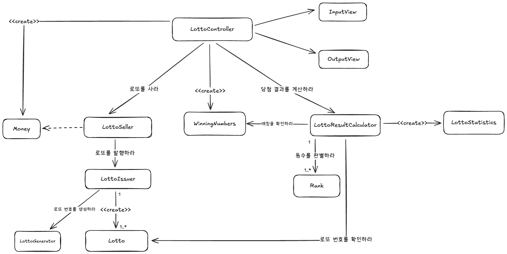

# java-lotto-precourse

# 기능 요구 사항 목록

## 금액 입력

- [X] 사용자로부터 구입 금액을 입력 받는다
- [X] 구입 금액에 해당하는 로또 개수를 계산한다
- [X] 구입한 로또 개수를 출력한다
- [X] 각 로또의 번호를 오름차순으로 출력한다

## 로또 생성

- [X] 입력받은 금액에 따라 로또 발행을 요청한다
- [X] 유효한 로또를 발행한다

## 당첨 번호 입력

- [X] 사용자로부터 당첨 번호 6개를 입력 받는다
- [X] 사용자로부터 보너스 번호를 입력 받는다

## 당첨 결과 계산

- [X] 각 로또의 번호를 당첨 번호와 비교한다
- [X] 일치 개수에 따라 등수를 결정
- [X] 등수별로 개수를 계산한다
- [X] 총 수익률을 계산한다

## 출력

- [X] 당첨 통계를 출력한다.
- [X] 수익률을 소수점 둘째 자리에서 반올림하여 출력한다

## 애플리케이션 실행

- [X] Controller에서 애플리케이션의 흐름을 제어
- [X] AppConfig에서 의존성 주입
- [X] Application에서 main 메서드로 실행

## 금액 입력

- [X] 구입 금액은 숫자로 변환될 수 있어야 한다.
- [X] 구입 금액은 1,000원 이상이어야 한다.
- [X] 구입 금액은 1,000원 단위여야 한다.
- [X] 입력 값들에 대해 null 방어를 수행해야 한다

## 당첨 번호 입력

- [X] 당첨 번호 6개와 보너스 번호는 숫자로 변환될 수 있어야 한다.
- [X] 당첨 번호는 쉼표(,)로 정확히 6개가 입력되어야 한다.
- [X] 당첨 번호와 보너스 번호는 1부터 45 사이의 숫자여야 한다.
- [X] 당첨 번호 6개는 중복될 수 없다.
- [X] 보너스 번호는 당첨 번호와 중복될 수 없다.
- [X] 입력 값들에 대해 null 방어를 수행해야 한다

## 애플리케이션 실행 및 처리

- [X] 사용자 오류 발생 시, "[ERROR]" 메시지를 출력하고 해당 입력 단계부터 재시도해야 한다.
- [X] 개발자 오류 발생 시 애플리케이션은 즉시 종료되어야 한다.

## Domain 객체 구현 목록 (TDD 테스트 대상)

- [X] Money
    - 금액은 1000원 이상이어야 한다
    - 금액은 1000원 단위어야 한다
    - 로또 구매 개수를 계산해야 한다
- [X] Lotto
    - 번호는 6개여야 한다
    - 중복된 번호가 존재해서는 안 된다
    - 번호는 1~45 사이여야 한다
    - 번호는 오름차순이어야 한다
    - null 방어를 해야 한다
- [X] WinningNumbers
    - 당첨 번호 6개와 보너스 번호 1개를 가진다
    - 번호 중복과 범위 검증을 한다
    - 보너스 번호가 당첨 번호와 중복되지 않아야 한다
- [X] Rank
    - 일치 개수와 보너스 여부로 등수를 결정한다
    - 각 등수의 상금 정보를 가진다

---

# 설계

설계는 책임 주도 설계를 기반으로 진행되었습니다.
시스템이 수행해야 하는 책임들을 식별하여, 각 객체에게 책임을 할당하는 방식으로 진행하였습니다.

설계의 핵심은 **LottoSeller, LottoIssuer, LottoResultCalculator** 간의 협력에 있습니다.

- LottoSeller: 금액을 전달받아 로또 발행을 조율한다.
- LottoIssuer: 유효한 로또를 실제로 생성한다.
- LottoResultCalculator: 당첨 번호와 구매한 로또를 비교해 결과를 계산한다.

과제의 규모가 크지 않으므로, 객체 간의 협력 관계를 최대한 단순하게 유지하며,
각 객체가 명확한 책임을 가지며, 가독성을 높이는 방향으로 설계를 진행하였습니다.

## 객체 협력 다이어그램

다음은 객체들이 어떻게 협력하는지를 나타낸 다이어그램입니다.
> 아래의 다이어그램은 설계 초기 단계에서 작성된 것으로, 실제 구현과는 다소 차이가 있을 수 있습니다<br>
> 또한 객체 간의 모든 상호작용을 포함하지 않을 수 있습니다.<br>
> 다이어그램은 이해를 돕기 위한 참고 자료입니다.<br>
> 이 다이어그램은 설계가 진행됨에 따라 변경될 수 있습니다.



---

# 테스트 전략

테스트는 설계가 올바른지를 검증하기 위해 테스트를 우선 적용한 뒤 구현하는 방식을 채택하였습니다.
도메인 객체의 책임과 협력을 검증하기 위한 테스트를 통해 설계의 타당성을 빠르게 확인하는 것을 목적으로 합니다.

## 테스트 규칙

테스트 이름은 should -- When -- 형식을 따릅니다.<br>
예: shouldReturnRankWhenMatchCountIsSix

또한 각 테스트의 @DisplayName 어노테이션을 통해 테스트의 목적을 명확히 설명합니다.
DisplayName은 의도를 명확히 전달하는 데 중점을 둡니다.

각 테스트 메서드의 내부는 Given-When-Then 패턴을 따릅니다.

- Given: 테스트의 초기 상태를 설정합니다.
- When: 테스트 대상 메서드를 호출합니다.
- Then: 결과를 검증합니다.

## 단위 테스트 범위

본 프로젝트의 단위 테스트는 도메인 객체를 기반으로 진행됩니다.
외부 의존성 없이 순수하게 도메인 로직만을 포함하기 때문에, 각 객체의 생성, 검증, 연산 책임을 독립적으로 테스트하여
설계의 타당성과 코드의 정확성을 검증합니다.

도메인 단위의 테스트가 완료된 후, Controller와 View에 대해서는 통합 테스트에서 최소한의 검증을 수행합니다.

## 테스트 진행

단순한 성공 케이스 뿐만 아니라 Money의 1000원 단위 검증, Lotto의 6개/중복/범위 검증,
WinningNumbers의 보너스 번호 중복 검증 등 모든 유효성 검사 및 경곗값 예외를
TDD를 통해 꼼꼼히 검증하여 코드의 견고성을 확보하고자 노력하였습니다

또한, 이후에는 TDD 대신 코드를 구현하고 구현한 구현체에 대해서 테스트를 통해 검증하는 방식을 채택하였습니다.
이번 과제에서 테스트하기 어려운 영역은 랜덤성이라고 생각하였으며,
LottoGenerator라는 인터페이스를 통해 의존하도록 구축하여 고정 번호를 반환할 수 있도록 구축하였습니다.

이를 통해서 테스트 커버리지를 98% 이상 확보할 수 있었습니다.

---

# 프로젝트 구조

```
src/main/java/lotto
├── Application.java
├── application
│   ├── AppConfig.java
│   └── LottoController.java
├── domain
│   ├── generator
│   │   ├── LottoGenerator.java
│   │   └── RandomLottoGenerator.java
│   ├── model
│   │   ├── Lotto.java
│   │   ├── LottoStatistics.java
│   │   ├── Money.java
│   │   ├── Rank.java
│   │   └── WinningNumbers.java
│   └── service
│       ├── LottoIssuer.java
│       ├── LottoResultCalculator.java
│       └── LottoSeller.java
├── parser
│   ├── MoneyParser.java
│   └── WinningNumbersParser.java
└── view
    ├── InputView.java
    └── OutputView.java
```

---

# 핵심 설계와 고민

이번 과제는 단순히 기능 요구 사항을 만족하는 것을 넘어, 유지보수성, 유연성, 그리고 가독성이 높은 코드를 작성하는 것을 목표로 했습니다.
이 과정에서 마주친 여러 설계적 고민과 그에 대한 선택, 그리고 왜 그렇게 결정했는지를 기록합니다.

### 아키텍처와 패키지

3주차 미션에서는 핵심 비즈니스 로직을 다루는 Domain을 외부로부터 보호하는 것을 우선시하였습니다.
만약 도메인이 View를 알게 된다면 테스트하기 어려워질 것이라고 생각했습니다. 따라서 domain, application, view, parser 네 가지의
패키지를 통해 관심사를 분리하였습니다. 모든 의존성은 domain을 향하도록 설계하고자 하였으며, 가능한 domain 영역에서 대부분의 로직이 처리되도록 설계하고자 하였습니다.

특히 parser를 기존의 view 패키지 하부에서 분리하였는데, view는 화면에 보여주고 입력을 받는 영역에 대해서만 처리하고,
parser에는 view가 받은 문자열을 domain에서 이해할 수 있게끔 정제하는 책임을 부여했습니다.
따라서 view는 입력과 출력에만 할 수 있었으며, domain은 오직 도메인 로직만을 다룰 수 있습니다.

domain 패키지 내부는 model, service, generator로 나누어 설계하였습니다.
하나의 패키지 안에 모든 객체를 두면 이해가 어려워질 수 있다고 생각했습니다.

- model: 데이터와 그 데이터 고유의 규칙을 다루는 객체
- service: model 객체들을 조합하여 비즈니스 로직을 수행하는 객체
- generator: 로또 번호 생성과 관련된 책임을 가진 객체
  로 분리하여 각 객체의 역할과 책임이 명확히 드러나도록 하였습니다.

### RDD와 TDD

기존 2주차 미션을 거치며 객체지향을 준수하는 것 자체만으로 테스트 용이성을 확보할 수 있다고 판단하였습니다.
또한 이 과정에서 테스트를 통해 설계의 타당성을 검증할 수 있을 것이라고 생각했습니다.

따라서 이번 미션에서는 RDD(Responsibility-Driven Design)를 우선으로 하여 설계를 진행하고,
TDD(Test-Driven Development)는 설계가 올바른지를 검증하는 수단으로 활용하고자 하였습니다.
또한 TDD는 오직 데이터 객체에만 적용하여 도메인이 적절한 검증 책임을 지고 있는지를 명확히 파악할 수 있었습니다.

설계 이후에 테스트 코드를 먼저 작성함으로써 "어떻게 사용할지"에 대해 고민할 수 있었고,
이는 곧 설계 내부에서 파악하지 못했던 역할과 책임을 명확히 하는 데 도움이 되었습니다.

### 예외 처리

3주차 미션에서 가장 어려웠던 부분은 예외 처리였습니다.
기존의 예외 처리에서는 그냥 단순히 `throw new IllegalArgumentException("메시지")` 형태로 처리하면 되었지만,
이번 과제에서는 더욱 많은 고민을 해야 했습니다.

예외를 복구 가능 오류와 복구 불가능 오류로 분리하여, 개발자의 실수인 경우는 버그이며,
입력 실수는 예정된 예외로 처리해야한다는 점을 깨달았습니다.

따라서 복구 불가능한 시스템 버그의 경우는 fail-fast 전략을 따라야 한다고 생각했습니다.
`LottoController.run()`에서는 try-catch 블록을 두지 않고, 문제 발생 시 프로그램을 종료시켜야 한다고 생각했습니다.

반면에 사용자의 입력 오류에 대해서는 요구사항에 맞춰 재시도 가능하도록 수정하였습니다.
LottoController의 `requestMoney()`와 `requestWinningNumbers()` 메서드 내부에서 while-true 루프와 try-catch를 사용해,
사용자에게 에러 메시지를 출력한 뒤 해당 부분의 입력을 다시 받도록 하여 견고한 프로그램 흐름을 완성했습니다.

이 과정에서 커스텀 예외를 만들어서 ParsingError, ValidationError를 사용하면 좋지 않을까 고민했지만,
IllegalArgumentException은 "잘못된 인수가 전달됨"이라는 의미를 가장 명확하게 전달하는 Java 표준 예외이며,
new Money(-1000)(Validation Error)나 Parser의 변환 실패(Parsing Error)는 모두 이 잘못된 인수라는 의미에 부합한다고 판단했습니다.

더해서 `catch (ParsingError e)`와 `catch (ValidationError e)`처럼 catch 블록을 불필요하게 나누는 것은 아무런 이익이 없으며,
IllegalArgumentException 하나로 통일하는 것이 Controller를 가장 단순하고 실용적으로 유지하는 방법이라 판단했습니다

또한, Parser에서 발생하는 NumberFormatException은 시스템의 세부 사항이며,
이를 Controller가 알아야 할 수 있는 수준의 IllegalArgumentException으로 수정하여 던졌습니다.
덕분에 Controller는 Parser의 내부 구현을 알 필요 없이 IllegalArgumentException 하나만 일관되게 처리하도록 하였습니다

### 오버 엔지니어링

코드를 구현하면서 Factory, Builder, DTO, 커스텀 예외 등 다양한 설계 패턴들을 적용하는게 과연 좋을까? 고민했습니다.
하지만, 미션의 규모가 크지 않았으며, 가장 적절하고 실용적인 수준에서 설계를 유지하는 것이 중요하다고 판단했습니다.
따라서 불필요한 복잡성을 제거하는 것이 가독성 측면에서 더 유리하다고 생각했습니다.

- Factory 패턴을 사용하지 않은 이유: Money와 WinningNumbers의 생성자가 이미 스스로 모든 유효성 검증을 완벽하게 책임지고 있습니다.
  `입력 -> 변환 -> 도메인 객체 생성`의 흐름을 제어하는 것은 Controller의 역할 중 하나라고 생각했으며,
  단순한 new 호출을 위해 불필요한 Factory 계층을 두는 것은 과도한 설계라고 판단했습니다.


- DTO를 사용하지 않은 이유: DTO는 계층 간의 의존성을 완전히 분리할 때 유용하다고 생각합니다.
  하지만 이 프로젝트에서 OutputView는 LottoStatistics 같은 도메인 모델을 읽기 전용으로만 사용하며, 모델을 오염시킬 위험이 없습니다.
  이 상황에서 DTO를 도입하는 것은 LottoStatistics와 똑같이 생긴 DTO 클래스를 하나 더 만드는 불필요한 코드 중복일 뿐이라고 판단했습니다.


- 커스텀 예외를 사용하지 않은 이유: IllegalArgumentException은 "잘못된 인수가 전달됨"이라는 의미를 명확하게 전달할 수 있다고 판단했습니다.
  new Money(-1000)나 파싱오류는 모두 이 잘못된 인수라는 의미에 완벽하게 부합했기에 필요가 없다고 생각했습니다. 