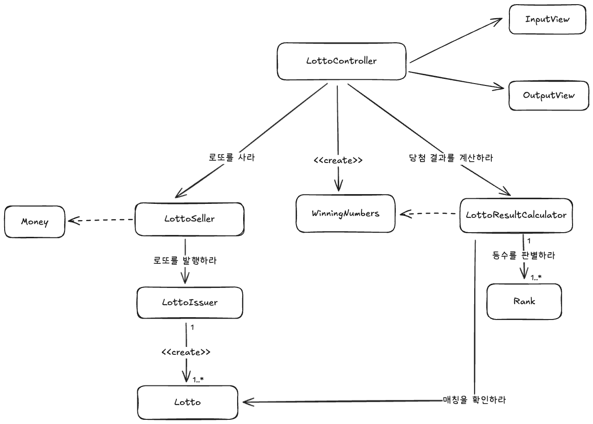

# java-lotto-precourse

# 기능 요구 사항 목록

## 금액 입력

- [X] 사용자로부터 구입 금액을 입력 받는다
- [X] 구입 금액에 해당하는 로또 개수를 계산한다
- [X] 구입한 로또 개수를 출력한다
- [X] 각 로또의 번호를 오름차순으로 출력한다

## 로또 생성

- [X] LottoSeller는 입력받은 금액에 따라 로또 발행을 요청한다
- [X] LottoIssuer는 유효한 Lotto를 N장 발행한다

## 당첨 번호 입력

- [X] 사용자로부터 당첨 번호 6개를 입력 받는다
- [X] 사용자로부터 보너스 번호를 입력 받는다

## 당첨 결과 계산

- [X] LottoResultCalculator는 각 로또의 번호를 당첨 번호와 비교한다
- [X] 일치 개수에 따라 Rank를 결정
- [X] Rank별로 개수를 계산한다
- [ ] 총 수익률을 계산한다

## 출력

- [ ] 당첨 통계를 출력한다.
- [ ] 수익률을 소수점 둘째 자리에서 반올림하여 출력한다

## Domain 객체 구현 목록 (TDD 테스트 대상)

- [X] Money
    - 금액은 1000원 이상이어야 한다
    - 금액은 1000원 단위어야 한다
    - 로또 구매 개수를 계산해야 한다
- [X] Lotto
    - 번호는 6개여야 한다
    - 중복된 번호가 존재해서는 안 된다
    - 번호는 1~45 사이여야 한다
    - 번호는 오름차순이어야 한다
    - null 방어를 해야 한다
- [X] WinningNumbers
    - 당첨 번호 6개와 보너스 번호 1개를 가진다
    - 번호 중복과 범위 검증을 한다
    - 보너스 번호가 당첨 번호와 중복되지 않아야 한다
- [X] Rank
    - 일치 개수와 보너스 여부로 등수를 결정한다
    - 각 등수의 상금 정보를 가진다

---

# 설계

설계는 책임 주도 설계를 기반으로 진행되었습니다.
시스템이 수행해야 하는 책임들을 식별하여, 각 객체에게 책임을 할당하는 방식으로 진행하였습니다.

설계의 핵심은 **LottoSeller, LottoIssuer, LottoResultCalculator** 간의 협력에 있습니다.

- LottoSeller: 금액을 전달받아 로또 발행을 조율한다.
- LottoIssuer: 유효한 로또를 실제로 생성한다.
- LottoResultCalculator: 당첨 번호와 구매한 로또를 비교해 결과를 계산한다.

과제의 규모가 크지 않으므로, 객체 간의 협력 관계를 최대한 단순하게 유지하며,
각 객체가 명확한 책임을 가지며, 가독성을 높이는 방향으로 설계를 진행하였습니다.

## 객체 협력 다이어그램

다음은 객체들이 어떻게 협력하는지를 나타낸 다이어그램입니다.
> 아래의 다이어그램은 설계 초기 단계에서 작성된 것으로, 실제 구현과는 다소 차이가 있을 수 있습니다 
> 또한 객체 간의 모든 상호작용을 포함하지 않을 수 있습니다. 
> 다이어그램은 이해를 돕기 위한 참고 자료입니다. 
> 이 다이어그램은 설계가 진행됨에 따라 변경될 수 있습니다.

---

# 테스트 전략

테스트는 설계가 올바른지를 검증하기 위해 테스트를 우선 적용한 뒤 구현하는 방식을 채택하였습니다.
도메인 객체의 책임과 협력을 검증하기 위한 테스트를 통해 설계의 타당성을 빠르게 확인하는 것을 목적으로 합니다.

## 테스트 규칙

테스트 이름은 should -- When -- 형식을 따릅니다.
예: shouldReturnRankWhenMatchCountIsSix

또한 각 테스트의 @DisplayName 어노테이션을 통해 테스트의 목적을 명확히 설명합니다.
DisplayName은 의도를 명확히 전달하는 데 중점을 둡니다.

각 테스트 메서드의 내부는 Given-When-Then 패턴을 따릅니다.

- Given: 테스트의 초기 상태를 설정합니다.
- When: 테스트 대상 메서드를 호출합니다.
- Then: 결과를 검증합니다.

## 단위 테스트 범위

본 프로젝트의 단위 테스트는 도메인 객체를 기반으로 진행됩니다.
외부 의존성 없이 순수하게 도메인 로직만을 포함하기 때문에, 각 객체의 생성, 검증, 연산 책임을 독립적으로 테스트하여
설계의 타당성과 코드의 정확성을 검증합니다.

도메인 단위의 테스트가 완료된 후, Controller와 View에 대해서는 통합 테스트에서 최소한의 검증을 수행합니다